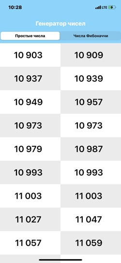

# Генератор чисел
ДанныЙ проект является реализациеq тестового задания для собеседования на позицию iOS Developer.

## Задание:
Предлагаем написать простое приложение, которое будет выводить
бесконечно прокручиваемую табличку со всеми «простыми» числами
и числами Фибоначчи.

То есть человек может скроллить вниз таблицу бесконечно и в ней будут
появляться все новые и новые простые числа. Чтобы генерация сложных
чисел не тормозила таблицу, предлагаю вызовы генерации сделать
асинхронными и пакетными.

Условия:
- Kotlin для Android, Swift для iOS
- Таблица в две колонки
- Фоны ячеек должны чередоваться в шахматном порядке
- Прокрутка не должна тормозить
- Память не должна утекать

Остальное по вкусу. Переключение списка «простые/фибоначчи» можно
сделать как угодно, во вложении картинка просто как пример.

### Пример:

# Итог работы:

!(/pictures/photo_2022-07-21 10.31.40.jpeg)

